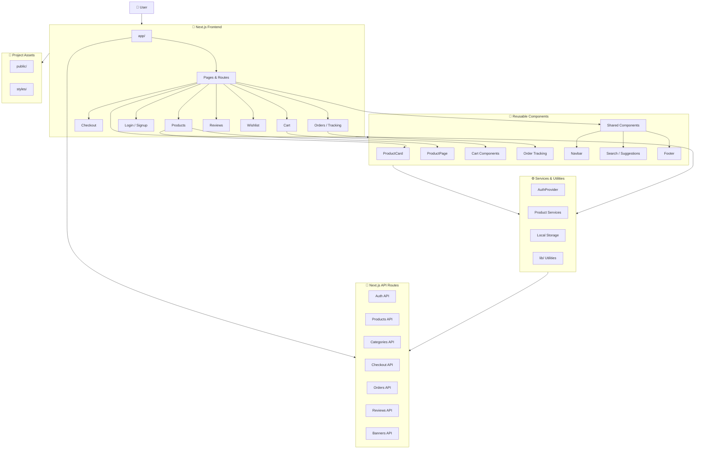
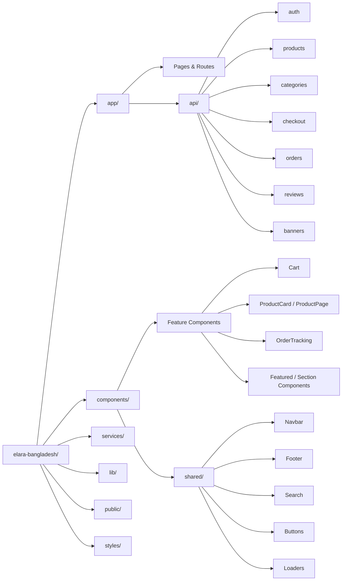
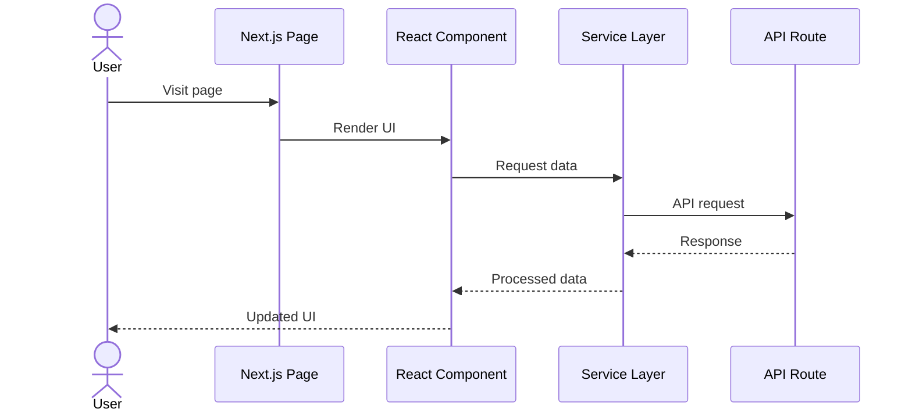

# Elara Bangladesh 🇧🇩

A modern, responsive e-commerce website built for **Elara Bangladesh** with a clean shopping experience for everyday smart essentials, gadgets, and lifestyle products.

## 🌐 Live Demo

**[Visit Elara Bangladesh](https://elara-bangladesh.vercel.app/)**

## 📸 Screenshots

### 🏠 Home Page


### 🛍️ Product Page


### 📦 Product Details


### 💳 Checkout


## ✨ Features

- 🛍️ Modern e-commerce storefront
- 🔎 Product search functionality
- 🗂️ Category-based product browsing
- 📦 Product listing and product details
- 🛒 Shopping cart management
- 💳 Checkout flow
- 👤 User authentication
- ❤️ Wishlist functionality
- ⭐ Product reviews and ratings
- 📋 Order management
- 🚚 Order tracking
- 📱 Fully responsive design
- 🧩 Reusable and organized components
- 📄 About, Contact, Shipping, Return, Terms & Conditions pages
- ⚡ Fast and modern user experience

## 🛠️ Tech Stack

- **Next.js**
- **React**
- **JavaScript / JSX**
- **CSS**
- **Next.js App Router**
- **API Routes**
- **Vercel**

## 📂 Project Structure

```text
elara-bangladesh/
├── app/
│   ├── api/
│   ├── cart/
│   ├── checkout/
│   ├── contact/
│   ├── login/
│   ├── orders/
│   ├── products/
│   ├── reviews/
│   ├── signup/
│   ├── track/
│   ├── wishlist/
│   └── ...
│
├── components/
│   ├── Cart/
│   ├── OrderTracking/
│   ├── ProductCard/
│   ├── OrderTracking/
│   ├── Navbar/
│   ├── Footer/
│   ├── SearchSuggestions/
│   └── ...
│
├── lib/
├── public/
├── styles/
├── package.json
└── README.md
```

## 🏗️ Project Architecture

The application follows a **Next.js App Router architecture** with a clear separation between routes, API endpoints, reusable components, services, and static assets.

### Architecture Diagram



### Folder Architecture



### Data Flow



### Architecture Responsibilities

| Layer | Responsibility |
| --- | --- |
| `app/` | Routes, pages, layouts, and route-specific application logic |
| `app/api/` | Server-side API endpoints |
| `components/` | Reusable feature and UI components |
| `components/shared/` | Common UI such as Navbar, Footer, Search, Buttons, Loaders, etc. |
| `services/` | Authentication, product retrieval, local storage, and application services |
| `lib/` | Shared helper functions and utilities |
| `public/` | Static images and public assets |
| `styles/` | Global and custom styling |

## 🛒 Main Shopping Flow

```text
Home
  ↓
Browse Products
  ↓
Product Details
  ↓
Add to Cart
  ↓
Cart
  ↓
Checkout
  ↓
Order
  ↓
Order Tracking
```

## 📄 Main Pages

### Storefront
- Home
- Products
- Product Details
- Categories
- Search
- New Arrivals
- Featured Products

### Customer
- Login
- Signup
- Wishlist
- Cart
- Checkout
- Orders
- Order Tracking
- Reviews

### Information
- About Us
- Contact
- Shipping Policy
- Return Policy
- Terms & Conditions

## ⚙️ Getting Started

### 1. Clone the repository

```bash
git clone <your-repository-url>
cd elara-bangladesh
```

### 2. Install dependencies

```bash
npm install
```

### 3. Run the development server

```bash
npm run dev
```

Open **http://localhost:3000** in your browser.

## 📦 Production Build

```bash
npm run build
```

Run the production server:

```bash
npm start
```

## 🚀 Deployment

This project is deployed on **Vercel**.

### Deployment Steps

1. Push the project to GitHub.
2. Import the repository into Vercel.
3. Configure the required environment variables.
4. Deploy the project.
5. Open the production URL.

**Live URL:** https://elara-bangladesh.vercel.app/

## 🎨 UI / UX

The project focuses on a clean and modern e-commerce interface with:

- Responsive layouts
- Product-focused design
- Simple navigation
- Clear call-to-action buttons
- Reusable product cards
- Dedicated product details
- Smooth shopping flow
- Mobile-friendly experience
- Consistent component design

## 📱 Responsive Design

The website is designed to work across:

- 📱 Mobile
- 📲 Tablet
- 💻 Laptop
- 🖥️ Desktop

## 🔐 Security

For production usage:

- Keep sensitive credentials inside environment variables.
- Never commit `.env.local` or other secret files.
- Validate important data on the server.
- Protect authenticated API routes.
- Never trust client-side order totals or product prices.

## 👨‍💻 Developer

**Mujahid Emon**

I designed and developed **Elara Bangladesh** as a complete e-commerce web project, including the storefront, product experience, cart, checkout, authentication, orders, reviews, and supporting pages.

🌐 **Live Project:**  
https://elara-bangladesh.vercel.app/

## 📌 Project Status

**Status:** ✅ Completed

The project is currently live and deployed on Vercel.

---

<p align="center">
  Built with ❤️ by <strong>Mujahid Emon</strong>
</p>
